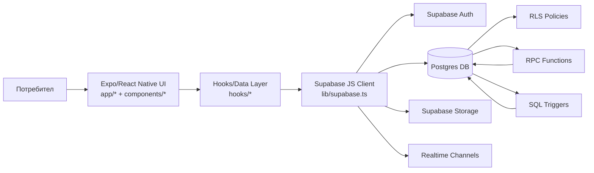
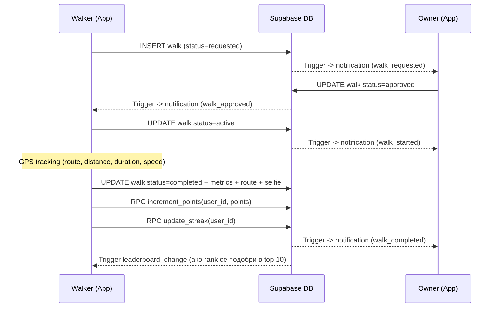
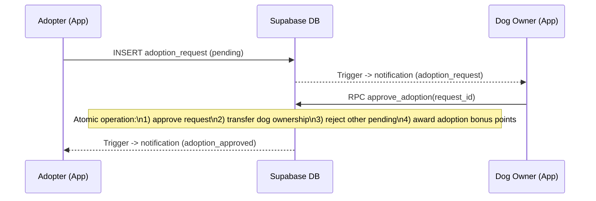
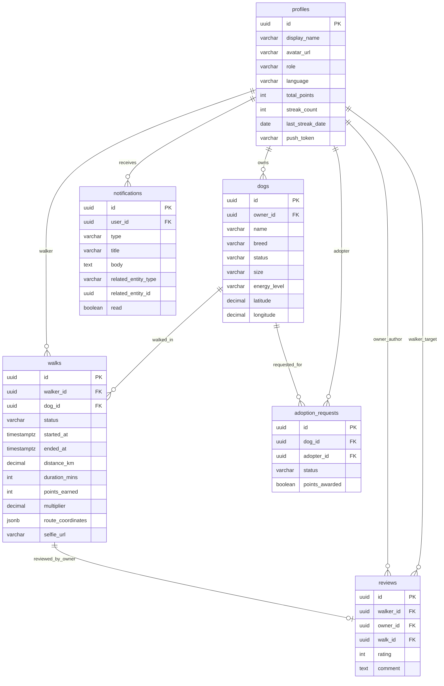

# DogGo - Техническа документация и цялостно описание (BG)

## 1. Въведение

`DogGo` е мобилно приложение за разходки и осиновяване на кучета, изградено с Expo/React Native (client-side) и Supabase (server-side).

Приложението покрива следните основни бизнес домейни:
- удостоверяване на потребители,
- управление на профили и кучета,
- процес по разходки (заявка -> одобрение -> активна разходка -> приключване),
- процес по осиновяване,
- система за точки, streak и leaderboard,
- in-app нотификации,
- двуезичен интерфейс (български/английски).

---

## 2. Архитектура на проекта (high level)

Архитектурният стил е **Mobile Client + BaaS**.

### 2.1 Компоненти

1. **Client app (Expo/React Native)**
   - Екрани, навигация, UI компоненти, анимации, локални валидации.
   - Device интеграции: GPS, камера/галерия, карти.

2. **Supabase (backend platform)**
   - **Auth** (email/password, session lifecycle).
   - **Postgres** (основните бизнес таблици).
   - **RLS (Row Level Security) policies** (контрол на достъпа на ниво редове).
   - **RPC (Remote Procedure Call) функции** (атомарна бизнес логика server-side).
   - **Triggers** (автоматични реакции при събития).
   - **Storage** (снимки за профили/кучета/селфита).

### 2.2 Логически поток

1. Потребителят извършва действие в екран (`app/...`).
2. Екранът вика hook (`hooks/...`) за fetch/mutation.
3. Hook използва `supabase` клиента (`lib/supabase.ts`).
4. Supabase изпълнява SQL + RLS + RPC/trigger логика.
5. Резултатът се връща към hook -> UI се обновява.

---

## 3. Client-side vs Server-side

## 3.1 Client-side (в приложението)

Клиентската част е отговорна за:
- визуализация и UX,
- навигация по екрани,
- събиране на вход от потребителя,
- извикване на backend операции,
- временни/локални изчисления за live UI,
- интеграция с device APIs.

### Основни client-side модули

- `app/` - екрани и routing (expo-router, file-based).
- `components/` - UI примитиви и reusable визуални блокове.
- `hooks/` - data hooks (fetch/mutate, loading/error state).
- `contexts/auth-context.tsx` - глобално auth/session/profile състояние.
- `lib/` - инфраструктурни helper-и (`auth.ts`, `supabase.ts`, `location.ts`, `storage.ts`, `points.ts`).
- `i18n/` - локализация.

### Client-side примери

- `lib/location.ts`: Haversine distance, GPS helper `getCurrentLocation`.
- `hooks/use-walk-tracking.ts`: live tracking за route/distance/speed/time.
- `lib/points.ts`: формула за точки от разходка.
- `app/walk/[id].tsx`: live walk UI и приключване на разходка.

## 3.2 Server-side (Supabase)

Сървърната част е отговорна за:
- данни и консистентност,
- права и защита (RLS),
- бизнес правила,
- атомарни операции,
- автоматични нотификации/side effects.

### Основни server-side елементи

- Таблици: `profiles`, `dogs`, `walks`, `adoption_requests`, `reviews`, `notifications`.
- RLS политики: в `supabase/migrations/001_initial_schema.sql`.
- RPC функции: в `supabase/migrations/002_indexes_rpc_functions.sql`.
- Triggers за нотификации: `supabase/migrations/003_notification_triggers.sql`, `004_energy_level_and_leaderboard_trigger.sql`.
- CHECK constraints: `supabase/migrations/005_walks_check_constraints.sql`.

### Важен принцип

**Критичната бизнес логика е server-side source of truth.**
Пример: бонусът при одобрено осиновяване е в SQL функцията `public.approve_adoption`, а не в клиентска константа.

---

## 4. Комуникация между client и server

Комуникацията се реализира чрез `@supabase/supabase-js`:

- Таблични операции:
  - `.from('table').select()`
  - `.insert()` / `.update()` / `.delete()`
- RPC:
  - `.rpc('function_name', params)`
- Storage:
  - `.storage.from(bucket).upload()`
  - `.getPublicUrl()`
  - `.createSignedUrl()`
- Realtime:
  - channel subscription за `notifications`.

Централен вход: `lib/supabase.ts`.

---

## 5. Технологии и роля на всяка

## 5.1 Frontend стек

- **React Native** - UI framework за native мобилни приложения.
- **Expo** - tooling/runtime за бързо mobile развитие.
- **expo-router** - file-based routing и навигация.
- **TypeScript** - типова безопасност в целия код.
- **react-native-reanimated** - плавни анимации.
- **react-native-maps** - карти и визуализация на маршрут.
- **expo-location** - GPS разрешения и локационни данни.
- **expo-image-picker** - достъп до камера/галерия.
- **i18next + react-i18next + expo-localization** - локализация.

## 5.2 Backend стек

- **Supabase Auth** - login/register/session.
- **Supabase Postgres** - релационна база данни.
- **RLS** - security model на ниво редове.
- **SQL RPC функции** - domain операции с атомарност.
- **SQL triggers** - автоматични реакции при DB събития.
- **Supabase Storage** - съхранение на изображения.

## 5.3 Как са свързани

1. UI компонент -> Hook.
2. Hook -> Supabase SDK.
3. SDK -> Auth/DB/Storage.
4. DB -> trigger/RPC/RLS.
5. Отговорът се връща обратно към UI.

---

## 6. Структура на кода (по директории)

- `app/` - екрани/роути:
  - `(auth)` - login/register,
  - `(tabs)` - home/adoption/leaderboard/profile,
  - `walk/`, `dog/`, `adoption/`, `profile/` подпотоци,
  - `notifications.tsx`, `settings.tsx`.
- `components/` - reusable UI (cards, buttons, map, stats, notification item, etc.).
- `hooks/` - data layer:
  - query hooks (`use-nearby-dogs`, `use-my-walks`, `use-leaderboard`...),
  - mutation hooks (`use-walk-mutations`, `use-adoption-mutations`, `use-dog-mutations`).
- `contexts/` - app-level context (`AuthProvider`).
- `lib/` - infra/helpers.
- `supabase/migrations/` - schema и SQL логика.
- `types/database.ts` - домейн типове.

---

## 7. Модел на данните (domain model)

## 7.1 Основни таблици

1. **profiles**
   - profile информация, език, точки, streak.
2. **dogs**
   - кучета, собственик, статус, локация, енергийно ниво.
3. **walks**
   - lifecycle и метрики на разходка.
4. **adoption_requests**
   - заявки за осиновяване и флаг `points_awarded`.
5. **reviews**
   - оценки след разходки.
6. **notifications**
   - in-app нотификации.

## 7.2 Ключови ограничения

- CHECK constraints за валидни стойности (distance, duration, points, rating).
- Partial unique index за активни adoption заявки.
- RLS policies за ограничения по `auth.uid()`.

---

## 8. Подробни flow-ове

## 8.1 Auth flow

1. `login/register` екран вика `signIn/signUp` (`lib/auth.ts`).
2. Supabase Auth връща session.
3. `AuthProvider` зарежда профила (`profiles`).
4. Route guard в `app/_layout.tsx` пренасочва към `(tabs)` или `(auth)`.
5. При signup SQL trigger `handle_new_user` създава `profiles` ред.

## 8.2 Home + nearby dogs flow

1. Home взима текуща локация (`getCurrentLocation`).
2. Hook `useNearbyDogs` чете кучета (`status in ['walk','both']`).
3. Смята се дистанция за сортиране/филтри.
4. UI показва карти + филтри + active walk banner.

## 8.3 Dog CRUD flow

1. Add/Edit екран събира форма + снимка + координати.
2. `useDogMutations`:
   - качва снимка в Storage (`dog-photos`),
   - прави insert/update в `dogs`.
3. Delete: delete в `dogs` + delete снимка от Storage.

## 8.4 Walk lifecycle flow

1. **Request**: walker създава ред в `walks` (`requested`).
2. **Approve/Reject**: owner променя `status`.
3. **Start**: `status=active`, `started_at`.
4. **Active tracking**:
   - GPS watch updates,
   - route accumulation,
   - live distance/duration/speed в UI.
5. **End**:
   - stop tracking,
   - optional selfie upload,
   - update `walks` с метрики и route,
   - `increment_points` за walker,
   - `update_streak` бонус.
6. **Summary**: карта + статистики + селфи + ревю.

## 8.5 Adoption flow

1. Потребителят праща `adoption_request`.
2. Owner одобрява през RPC `approve_adoption(request_id)`.
3. RPC atomically:
   - approve целевата заявка,
   - transfer ownership в `dogs`,
   - reject останалите заявки,
   - начислява adoption bonus points server-side (еднократно).

## 8.6 Notification flow (in-app)

1. SQL trigger вмъква ред в `notifications` при домейн събитие.
2. `useNotifications` чете списъка и слуша realtime промени.
3. `notifications` екран показва събития и навигира към свързан entity екран.

## 8.7 Leaderboard flow

1. `useLeaderboard(period)` вика RPC `get_leaderboard`.
2. SQL агрегира `walks.points_earned` по период.
3. UI визуализира рангове за Daily/Weekly/Monthly/All time.

---

## 9. Сигурност и валидиране

## 9.1 Security layers

1. **Auth** - само аутентикирани потребители.
2. **RLS** - достъп до "моите" редове/разрешени редове.
3. **DB constraints** - range checks и rating checks.
4. **RPC с SECURITY DEFINER** - контролирани атомарни операции.

## 9.2 Клиентски проверки vs сървърни проверки

- Клиентските проверки са UX и early validation.
- Сървърните проверки са authoritative и защитават данните.

---

## 10. Работа със снимки (Storage)

- Buckets: `avatars`, `dog-photos`, `walk-selfies`.
- Upload: base64 -> binary -> `upload` -> URL.
- При показване на селфита се използва `resolveImageUrl` за:
  - local uri,
  - public URL,
  - signed URL fallback.

---

## 11. Локализация и теми

## 11.1 i18n

- Конфигурация: `i18n/config.ts`.
- Езици: `i18n/locales/en.json`, `i18n/locales/bg.json`.
- В settings езикът се сменя runtime и се записва в `profiles.language`.

## 11.2 Theme system

- Палитра: `constants/theme.ts`.
- Accessor: `useThemeColor`.
- Поддържат се light/dark стойности.

---

## 12. Build/run и среда

## 12.1 Локално стартиране

```bash
npm install
npx expo start
```

## 12.2 Environment

Използват се `EXPO_PUBLIC_SUPABASE_URL` и `EXPO_PUBLIC_SUPABASE_ANON_KEY`.

## 12.3 База данни

- Миграции: `supabase/migrations/*.sql`.
- Setup guide: `DATABASE_SETUP.md`.

---

## 13. Известни архитектурни решения

1. Hook-базиран data слой вместо централен state manager.
2. Част от логиката (напр. live distance sort) е client-side за бърз UX.
3. Критичните домейн действия (осиновяване бонус, leaderboard SQL) са server-side.
4. Нотификациите в момента са in-app (DB + realtime).

---

## 14. Какво би било добре да се надгради ????!!!!(май да ги махнем/променим тея неща)

1. Централизиран cache/invalidation (напр. React Query).
2. Unified error taxonomy (domain errors + user-friendly messages).
3. Integration tests за ключови SQL RPC операции.
4. Отделен архитектурен слой за domain services (по-изчистени hooks).
5. По-строг monitoring/telemetry за production инстанция.

---

## 15. Карта на действията: App -> RPC/Trigger -> Промени в БД

| Действие в приложението | Механизъм | Къде е дефиниран | Какво променя |
| --- | --- | --- | --- |
| Регистрация на нов потребител | Trigger `on_auth_user_created` -> `handle_new_user` | `supabase/migrations/001_initial_schema.sql` | Insert в `profiles` |
| Заявка за разходка | Insert в `walks` + Trigger `on_walk_requested` | Insert от `hooks/use-walk-mutations.ts`, trigger в `supabase/migrations/003_notification_triggers.sql` | Нов ред в `walks` + insert в `notifications` |
| Одобряване на разходка | Update `walks.status='approved'` + Trigger `on_walk_status_change` | Update от `hooks/use-walk-mutations.ts`, trigger в `supabase/migrations/003_notification_triggers.sql` | Update в `walks` + insert в `notifications` |
| Стартиране на разходка | Update `walks.status='active'` + Trigger `on_walk_status_change` | Update от `hooks/use-walk-mutations.ts`, trigger в `supabase/migrations/003_notification_triggers.sql` | Update в `walks` + insert в `notifications` |
| Приключване на разходка | Update в `walks` + RPC `increment_points` + RPC `update_streak` + Trigger `on_walk_status_change` + Trigger `trg_leaderboard_change` (ако има rank промяна) | `hooks/use-walk-mutations.ts`, `hooks/use-streak.ts`, `supabase/migrations/002_indexes_rpc_functions.sql`, `supabase/migrations/003_notification_triggers.sql`, `supabase/migrations/004_energy_level_and_leaderboard_trigger.sql` | Update в `walks`, update в `profiles.total_points/streak`, insert в `notifications` |
| Заявка за осиновяване | Insert в `adoption_requests` + Trigger `on_adoption_requested` | Insert от `hooks/use-adoption-mutations.ts`, trigger в `supabase/migrations/003_notification_triggers.sql` | Нов ред в `adoption_requests` + insert в `notifications` |
| Одобряване на осиновяване | RPC `approve_adoption` + Trigger `on_adoption_approved` | RPC в `supabase/migrations/002_indexes_rpc_functions.sql`, trigger в `supabase/migrations/003_notification_triggers.sql` | Update в `adoption_requests`, update в `dogs.owner_id/status`, update в `profiles.total_points`, insert в `notifications` |
| Зареждане на leaderboard | RPC `get_leaderboard` | `supabase/migrations/002_indexes_rpc_functions.sql` | Read-only агрегирана справка върху `walks` + `profiles` |

### Забележка

- **RPC** се вика изрично от клиента (`supabase.rpc(...)`) при целенасочена бизнес операция.
- **Trigger** се изпълнява автоматично от базата след `INSERT/UPDATE`, без клиентът да го вика директно.

---

## 16. Визуални диаграми (Mermaid)

## 16.1 Архитектура: Client -> Supabase



## 16.2 Walk flow (end-to-end)



## 16.3 Adoption flow (end-to-end)



## 16.4 ER диаграма (основни таблици и връзки)



### Бележки към ER модела

- `profiles -> dogs` е `1:N`: един профил може да има много кучета.
- `profiles -> walks` е `1:N` (като walker), а `dogs -> walks` също е `1:N`.
- `adoption_requests` е свързваща таблица между `profiles` (adopter) и `dogs`.
- `reviews` свързва конкретна разходка (`walk_id`) с автор (owner) и оценяван (walker).
- `notifications` е общ журнал за събития, адресиран към конкретен потребител (`user_id`).


